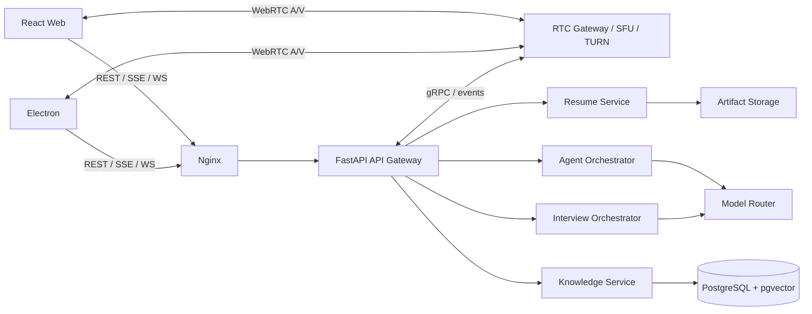
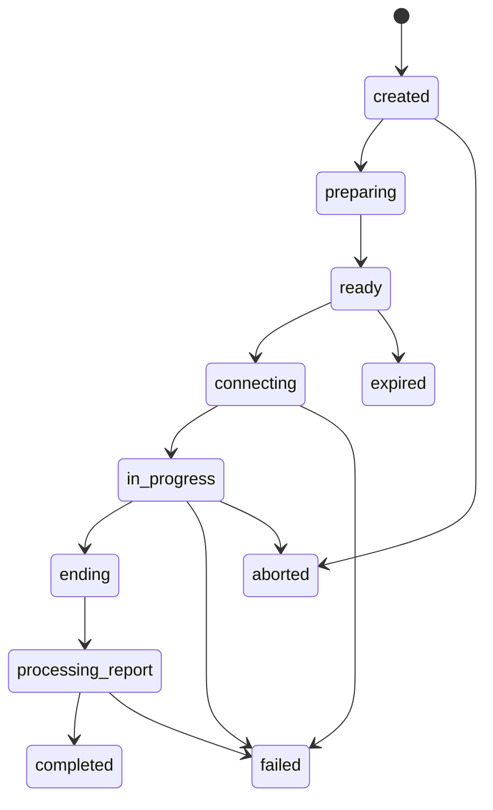
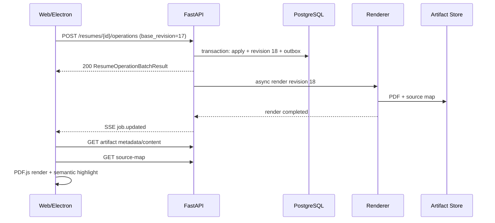
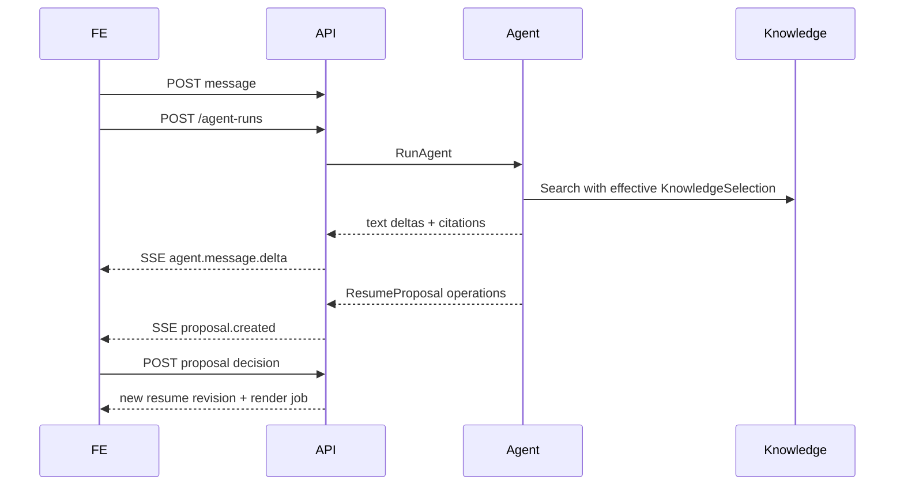

# AI 求职 Workspace：前后端调用约定 v1.0

> 状态：架构基线（Architecture Baseline）  
> 适用客户端：React/Vite Web、Electron Desktop  
> 适用服务端：FastAPI/Pydantic/asyncio，Nginx 反向代理，PostgreSQL/pgvector，异步 Agent 与媒体服务  
> 配套 Schema：`ai-job-workspace.contract.schema.jsonc`

---

## 1. 问题定义

本协议要解决的不是“前端如何调用某个 FastAPI 函数”，而是定义一层**长期稳定的产品语义契约**，使以下实现能够独立演进：

1. 前端框架、Web 与 Electron 壳、PDF 查看器、数字人渲染器；
2. 简历编译器：Puppeteer/HTML、XeLaTeX，或未来其他排版引擎；
3. Agent 编排：LangChain、其他工作流引擎、不同大模型供应商；
4. 检索与记忆：pgvector、其他向量库、不同切块与嵌入模型；
5. 实时媒体：WebRTC 网关、TURN/SFU、供应商数字人、客户端数字人。

协议的核心原则是：

- **传意图，不传实现。** 前端传“这个部分应更紧凑、放入侧栏、使用某个语义字体令牌”，不传 CSS、LaTeX 或 Puppeteer 指令。
- **传结果与证据，不传内部推理。** Agent 返回文本、引用、建议操作、状态和可审计证据，不返回模型私有思维链。
- **资源与长任务分离。** 资源描述持久状态；编译、索引、导入、报告生成等用 Job 表示。
- **控制、事件、媒体分层。** REST 管资源，SSE 推送单向事件，WebSocket 管实时双向控制，WebRTC 传音视频。
- **默认拒绝知识访问。** Agent 能否看见某条个人知识，由显式策略和会话选择共同决定。

### 1.1 非目标

公开协议不包含：

- XeLaTeX 模板源文件、HTML/CSS、Puppeteer 脚本；
- LangChain chain/graph、模型供应商名称、模型密钥；
- pgvector 表结构、chunk 内部主键、embedding 向量；
- TURN 长期凭证、Git 私钥、第三方 OAuth refresh token；
- 数字人供应商 SDK 的私有消息格式。

---

## 2. 总体架构与传输选择

### 2.1 四层通信面

| 通信面 | 推荐协议 | 用途 | 可靠性语义 |
|---|---|---|---|
| 控制面（Control Plane） | REST/HTTP JSON | CRUD、命令、权限、创建长任务 | HTTP 状态码；幂等键；ETag |
| 事件面（Event Plane） | SSE（Server-Sent Events） | Agent 输出、Job 进度、工作区通知 | 至少一次；按流有序；可恢复 |
| 实时控制面 | WebSocket 或 WebRTC DataChannel | 面试信令、中断、字幕、状态、质量报告 | 序列号 + ACK；可恢复 |
| 媒体面（Media Plane） | WebRTC | 用户 A/V 上行、数字人 A/V 下行 | RTP/WebRTC 自身拥塞控制与抖动处理 |
| 服务内部 | gRPC/Protobuf | 服务间 RPC、类型生成、内部流 | unary / server-stream / bidi-stream |

### 2.2 推荐拓扑



**边界说明：** Nginx 代理 REST、SSE、WebSocket 和 WebRTC 信令；WebRTC 媒体通常直接进入 RTC Gateway/TURN，而不是由 FastAPI 读取每个 RTP 包。若部署环境强制所有媒体走 HTTP，则启用 `websocket_binary` 兜底，但该模式应被视为兼容路径，而非主路径。

### 2.3 为什么不是“全 gRPC”或“全 WebSocket”

- 浏览器对标准 REST、SSE、WebRTC 支持更直接；外部 API 全 gRPC 会引入 gRPC-Web/代理约束。
- WebSocket 很适合双向会话，但不适合承担所有普通 CRUD、缓存、条件请求、下载与分页。
- SSE 对聊天 token、Job 进度这种单向推送更简单，并具有天然的事件 ID 与重连语义。
- 媒体不应被 JSON/base64 包裹；音视频使用 WebRTC，控制事件使用 JSON。

---

## 3. 前后端职责边界

| 领域 | 前端负责 | 后端负责 | 共享契约 |
|---|---|---|---|
| 简历编辑 | 表单交互、本地草稿、操作批处理、PDF 浏览与高亮 | 权威校验、版本、归一化、编译、缓存、产物存储 | `ResumeDocument`、`ResumeOperationBatch`、`PdfSourceMap` |
| 模板 | 展示可选项、渲染设置控件 | 模板版本、能力约束、设置校验、渲染器绑定 | `TemplateManifest`、`ResumeStyleIntent` |
| Chatbot | 消息 UI、流式拼接、引用与建议审批 | 检索、Agent、工具调用、模型路由、持久化 | `AgentRunRequest`、`AgentStreamEvent`、`ResumeProposal` |
| 面试 | 摄像头/麦克风采集、播放媒体、客户端数字人渲染 | ASR、Agent、TTS、数字人服务编排、报告生成 | `InterviewSession`、实时事件、媒体协商、`InterviewReport` |
| 知识库 | 添加来源、授权、可见性配置、同步状态 UI | 抓取、解析、切块、嵌入、检索、来源追踪 | `KnowledgeSource`、`KnowledgeVisibilityPolicy`、引用 |
| i18n | 根据稳定 key 本地化 UI | 返回稳定 code/key，可附回退文本 | `message_key`、`fallback_message`、`Accept-Language` |

### 3.1 两条硬规则

1. **前端不得提交原始 HTML/CSS/LaTeX 作为简历权威数据。**
2. **后端不得要求前端理解模型供应商、向量库、模板引擎或数字人 SDK 的内部对象。**

---

## 4. 公共 HTTP 约定

### 4.1 基础路径与版本

```text
/api/v1
```

- URL 中只放破坏性主版本（major version）。
- v1 内允许增加可选字段、资源和事件；不得改变已有字段含义。
- JSON Schema 使用 `schema_version`；实时事件使用 `protocol_version`。
- 模板、评估量表、报告算法均有各自不可变版本号。

### 4.2 JSON 命名与类型

- JSON 字段统一 `snake_case`。
- 时间戳为 RFC 3339；服务端持久事件统一 UTC。
- 时长统一 `*_ms`，容量统一 `*_bytes`，码率统一 `*_bps`。
- 金额等高精度数值若未来出现，以十进制字符串传输。
- ID 是不透明字符串；前端不得从前缀或排序推断业务意义。
- 请求中“省略字段”表示不修改；显式 `null` 表示清空，但仅限 Schema 允许 `null` 的字段。
- 除 `extensions` 外，公开对象默认拒绝未知字段，尽早发现拼写错误。

### 4.3 请求头

| Header | 必需性 | 语义 |
|---|---:|---|
| `Authorization: Bearer …` | 除公开模板预览外必需 | 用户或服务令牌 |
| `Accept-Language` | 推荐 | 错误回退文本语言；不改变业务数据 locale |
| `X-Request-Id` | 推荐 | 客户端生成的追踪 ID；服务端原样回传或生成 |
| `Idempotency-Key` | 创建/命令类 POST 必需 | 网络重试去重；作用域为用户 + 路径 |
| `If-Match` | 修改已有资源必需 | 乐观并发控制（Optimistic Concurrency Control） |
| `traceparent` | 可选 | 分布式追踪 |

响应应包含：

```text
ETag: "rev-18"
X-Request-Id: req_...
```

### 4.4 Content-Type

| 场景 | Content-Type |
|---|---|
| 普通 JSON | `application/json` |
| 错误 | `application/problem+json` |
| SSE | `text/event-stream` |
| PDF | `application/pdf` |
| 元数据局部修改 | `application/merge-patch+json` |
| 二进制上传 | 对象存储签名 URL 指定的类型 |

### 4.5 成功响应不套万能信封

不使用：

```json
{ "code": 0, "message": "ok", "data": { ... } }
```

直接返回资源；列表使用：

```json
{
  "items": [],
  "page": {
    "next_cursor": null,
    "has_more": false,
    "total_estimate": 0
  }
}
```

### 4.6 状态码

| 状态 | 使用场景 |
|---:|---|
| 200 | 查询或同步更新成功 |
| 201 | 创建资源成功；返回 `Location` |
| 202 | 已接受长任务；返回 Job 与 `Location` |
| 204 | 删除或无响应体命令成功 |
| 304 | 条件 GET 未修改 |
| 400 | 语法、头部、游标等请求错误 |
| 401 | 未认证或令牌失效 |
| 403 | 已认证但无权限；知识策略拒绝也属于此类 |
| 404 | 资源不存在或为防枚举而隐藏 |
| 409 | 领域冲突，例如状态机不允许当前命令 |
| 412 | `If-Match`/基础 revision 已过期 |
| 413 | 请求或上传过大 |
| 415 | 不支持的媒体类型 |
| 422 | Schema 或领域校验失败 |
| 429 | 限流或额度不足 |
| 500/502/503/504 | 服务内部、上游、过载、超时 |

### 4.7 错误模型

所有 HTTP 错误采用 `ProblemDetails`：

```json
{
  "type": "urn:aiws:error:resume:revision_conflict",
  "title": "Resume revision is stale",
  "status": 412,
  "detail": "The resume changed after revision 17.",
  "instance": "/api/v1/resumes/res_123/operations",
  "code": "resume.revision_conflict",
  "request_id": "req_123",
  "retryable": true,
  "retry_after_ms": null,
  "violations": [
    {
      "pointer": "/base_revision",
      "code": "stale_revision",
      "message": {
        "message_key": "errors.resume.stale_revision",
        "fallback_message": "请刷新或安全重放本地操作。",
        "params": { "current_revision": 19 }
      }
    }
  ],
  "extensions": {
    "current_revision": 19
  }
}
```

### 4.8 分页与过滤

- 列表统一游标分页：`?limit=50&cursor=...`。
- `limit` 默认 50，建议最大 200。
- 排序字段显式：`sort=-updated_at,title`。
- 过滤字段不复用自由文本 DSL；使用明确 query 参数。
- 大范围检索或复杂搜索使用 `POST /.../search`，避免过长 URL。

---

## 5. 资源总览

```text
Workspace
├── Resume
│   ├── ResumeRevision
│   ├── ResumeProposal
│   ├── ResumeRenderJob
│   └── RenderArtifact / PdfSourceMap
├── Conversation
│   ├── ChatMessage
│   └── AgentRun / ToolApproval
├── InterviewScenario
│   └── InterviewSession
│       ├── Transcript
│       ├── RecordingArtifact
│       └── InterviewReport
└── KnowledgeSource
    ├── KnowledgeSourceVersion
    └── KnowledgeIngestionJob
```

所有资源至少包含：

- `id`
- `created_at`
- `updated_at`
- `revision`
- 可选 `extensions`

删除默认采用软删除 + 异步清理；涉及个人知识或录音时，提供可审计的真正清除 Job。

---

## 6. Workspace、身份和审计 API

| Method | Path | 说明 |
|---|---|---|
| GET | `/me` | 当前用户、默认 workspace、客户端能力 |
| GET | `/workspaces` | 可访问的 workspace |
| POST | `/workspaces` | 创建 workspace |
| GET | `/workspaces/{workspace_id}` | 获取 workspace |
| PATCH | `/workspaces/{workspace_id}` | Merge Patch；要求 `If-Match` |
| GET | `/workspaces/{workspace_id}/members` | 成员列表 |
| POST | `/workspaces/{workspace_id}/invitations` | 创建邀请 |
| PATCH | `/workspace-members/{member_id}` | 修改角色/状态 |
| GET | `/workspaces/{workspace_id}/events` | SSE：资源与 Job 事件 |
| GET | `/workspaces/{workspace_id}/audit-events` | 权限、数据访问、Agent 工具调用审计 |

### 6.1 权限模型

基础角色：`owner / admin / editor / viewer`。知识可见性不只由 workspace 角色决定，还必须经过 `KnowledgeVisibilityPolicy`。

有效授权：

```text
EffectiveAccess = IdentityRole
                ∩ SourceVisibilityPolicy
                ∩ AgentScope
                ∩ SessionKnowledgeSelection
                ∩ ModelDataRegionPolicy
```

任一层拒绝即拒绝；拒绝优先于允许。

---

## 7. 简历编辑与模板协议

### 7.1 语义中间表示

简历权威数据使用**语义中间表示（Semantic Intermediate Representation, SIR）**：

```text
ResumeDocument
├── profile
├── sections[]
│   ├── kind
│   ├── content
│   └── items[]
├── template: { template_id, template_version }
└── style_intent
```

`ResumeDocument` 不包含：HTML、CSS、LaTeX、字体文件路径、DOM 坐标。

### 7.2 模板契约

`TemplateManifest` 向前端暴露：

- 支持的 section 类型；
- 语义区域 `zones`，例如 `main`、`sidebar`；
- 页面尺寸、输出格式；
- 字体、日期、项目符号等**令牌（token）**；
- 可配置 setting 的类型、默认值、范围和 i18n key；
- 能力：照片、侧栏、自定义 section、source map；
- 不可变的 `template_version`。

后端私有的 `RendererBinding` 将 Manifest/Intent 映射到 HTML/XeLaTeX；该绑定永不出现在公共 API。

### 7.3 模板 API

| Method | Path | 说明 |
|---|---|---|
| GET | `/resume-templates` | 模板列表；可按 locale、page_size、capability 过滤 |
| GET | `/resume-templates/{template_id}` | 获取最新或 `?version=` 指定版本 Manifest |
| GET | `/resume-templates/{template_id}/preview` | 获取预览图或演示 PDF |
| POST | `/resume-templates/{template_id}/compatibility-checks` | 检查某 Resume 是否可迁移 |

模板更新必须发布新版本；已有简历继续固定旧版本。迁移由显式 Job 完成，不能静默改变版式。

### 7.4 简历 CRUD 与版本

| Method | Path | 说明 |
|---|---|---|
| GET | `/resumes` | 列表 |
| POST | `/resumes` | 创建空白、从模板创建或克隆 |
| GET | `/resumes/{resume_id}` | 获取权威快照；返回 ETag |
| PATCH | `/resumes/{resume_id}` | 仅修改 title、locale 等资源元数据 |
| DELETE | `/resumes/{resume_id}` | 软删除并触发知识索引更新 |
| GET | `/resumes/{resume_id}/revisions` | 版本列表 |
| GET | `/resumes/{resume_id}/revisions/{revision}` | 指定快照 |
| POST | `/resumes/{resume_id}/restore-jobs` | 从某 revision 恢复，生成新 revision |
| POST | `/resume-import-jobs` | 从 PDF/DOCX/JSON 导入 |
| POST | `/resumes/{resume_id}/export-jobs` | 导出 PDF/DOCX/JSON |

### 7.5 编辑操作：使用领域操作，不使用数组索引 JSON Patch

普通资源元数据可以用 Merge Patch；简历主体使用 `ResumeOperationBatch`：

```http
POST /api/v1/resumes/{resume_id}/operations
Idempotency-Key: batch_...
If-Match: "rev-17"
Content-Type: application/json
```

```json
{
  "client_batch_id": "batch_01...",
  "base_revision": 17,
  "conflict_strategy": "rebase_if_safe",
  "operations": [
    {
      "operation_id": "op_01...",
      "op": "set_field",
      "target": {
        "entity_type": "item",
        "section_id": "sec_01...",
        "item_id": "itm_01..."
      },
      "field_path": ["position"],
      "value": "Senior Backend Engineer",
      "extensions": {}
    },
    {
      "operation_id": "op_02...",
      "op": "move_item",
      "from_section_id": "sec_exp",
      "to_section_id": "sec_exp",
      "item_id": "itm_01...",
      "after_item_id": null,
      "extensions": {}
    }
  ],
  "render_hint": "preview",
  "extensions": {}
}
```

原因：JSON Patch 的 `/sections/3/items/2` 依赖数组下标；一旦用户拖拽、离线编辑或 Agent 同时修改，路径很脆弱。领域操作只引用稳定 entity ID。

### 7.6 并发与离线重放

- 每批操作带 `base_revision` 和 `If-Match`。
- 每个 operation 有全局唯一 `operation_id`；服务端长期去重。
- `reject`：revision 不匹配即 412。
- `rebase_if_safe`：只自动重放不冲突的字段与 ID 操作。
- 无法安全重放时返回冲突明细，不进行部分静默覆盖。
- Electron 离线队列保存 operation batch；恢复网络后顺序重放。

### 7.7 Agent 对简历的修改

Agent 不直接篡改简历，默认产生 `ResumeProposal`：

```text
AgentRun
  → ResumeProposal(base_revision, operations[])
  → 前端展示 diff
  → POST /resume-proposals/{proposal_id}/decisions
  → 后端校验并应用
```

| Method | Path | 说明 |
|---|---|---|
| GET | `/resume-proposals/{proposal_id}` | 获取建议与 diff 数据 |
| POST | `/resume-proposals/{proposal_id}/decisions` | 全部接受、选择接受或拒绝 |

高风险操作（删除大量内容、替换整个文档、跨知识库写回）必须二次确认。

### 7.8 PDF 编译与预览

| Method | Path | 说明 |
|---|---|---|
| POST | `/resumes/{resume_id}/render-jobs` | 创建 preview/final/export 编译 Job |
| GET | `/resume-render-jobs/{job_id}` | Job 状态、诊断、产物 |
| GET | `/resume-render-jobs/{job_id}/events` | SSE 进度流 |
| POST | `/resume-render-jobs/{job_id}/cancellations` | 取消低优先级预览 |
| GET | `/render-artifacts/{artifact_id}` | 产物元数据 |
| GET | `/render-artifacts/{artifact_id}/content` | 下载；支持 Range/ETag |
| GET | `/render-artifacts/{artifact_id}/source-map` | 获取语义节点 → PDF 坐标映射 |

交互预览返回两个核心产物：

1. PDF；
2. `PdfSourceMap`。

```json
{
  "node_kind": "item",
  "node_id": "itm_01...",
  "field_path": ["highlights", "0"],
  "page": 1,
  "rects": [
    { "x": 42.0, "y": 310.5, "width": 510.0, "height": 32.0, "unit": "pt" }
  ]
}
```

它支持：

- 点击 PDF 跳到左侧表单；
- 表单聚焦时高亮 PDF；
- 把排版错误定位到 section/item，而不是暴露 LaTeX 行号；
- 后续实现“哪一条内容导致溢出”的可解释诊断。

### 7.9 预览调度建议

- 前端编辑 150–400 ms 防抖后发送操作；
- 后端只保留每个 resume 最新的低优先级 preview Job；
- final/export Job 不被预览取消；
- 若内容未变化且 `resume_revision + template_version + render_profile` 相同，复用缓存；
- PDF URL 为短期签名 URL，artifact 元数据长期稳定。

---

## 8. Chatbot 与 Agent 协议

### 8.1 资源模型

```text
Conversation
├── ChatMessage(role, content parts)
└── AgentRun
    ├── AgentStreamEvent
    ├── ToolApprovalRequest
    └── ResumeProposal / other artifact proposal
```

消息内容是分片（content parts），而非单一字符串：

- `text`
- `citation`
- `resume_proposal`
- `file`

这允许前端稳定渲染引用、附件和可审批操作，而不解析模型自造 Markdown 协议。

### 8.2 API

| Method | Path | 说明 |
|---|---|---|
| GET | `/conversations` | 会话列表 |
| POST | `/conversations` | 创建会话并绑定 capability/context |
| GET | `/conversations/{conversation_id}` | 会话详情 |
| PATCH | `/conversations/{conversation_id}` | 标题、归档状态 |
| DELETE | `/conversations/{conversation_id}` | 删除/软删除 |
| GET | `/conversations/{conversation_id}/messages` | 消息分页 |
| POST | `/conversations/{conversation_id}/messages` | 创建用户消息 |
| POST | `/agent-runs` | 启动一次 Agent Run |
| GET | `/agent-runs/{run_id}` | Run 状态 |
| GET | `/agent-runs/{run_id}/events` | SSE 输出流 |
| POST | `/agent-runs/{run_id}/cancellations` | 取消生成 |
| POST | `/tool-approvals/{approval_id}/decisions` | 批准/拒绝工具调用 |

### 8.3 Provider-independent 推理意图

前端不传 `model: qwen-xxx`、`provider: openrouter`，而传：

```json
{
  "quality_tier": "balanced",
  "latency_budget_ms": 15000,
  "cost_tier": "standard",
  "data_region": "cn",
  "allow_provider_fallback": true,
  "allow_external_model_processing": false
}
```

后端根据可用性、数据策略、成本和能力路由模型。这样模型替换不构成前端协议变更。

### 8.4 AgentRun 请求

```json
{
  "conversation_id": "conv_01...",
  "input_message_id": "msg_01...",
  "capability": "resume_edit",
  "context_refs": [
    { "resource_type": "resume", "id": "res_01...", "revision": 18 }
  ],
  "knowledge": {
    "mode": "policy_default",
    "include_source_ids": [],
    "exclude_source_ids": [],
    "pinned_versions": [],
    "agent_scope": "resume_assistant"
  },
  "inference": {
    "quality_tier": "balanced",
    "latency_budget_ms": 15000,
    "cost_tier": "standard",
    "data_region": "cn",
    "allow_provider_fallback": true,
    "allow_external_model_processing": false
  },
  "output_modes": ["text", "citations", "resume_operations"],
  "response_locale": "zh-CN",
  "stream": true,
  "extensions": {}
}
```

### 8.5 SSE 事件

推荐事件类型：

```text
agent.run.started
agent.status
agent.message.delta
agent.citation.added
agent.resume_proposal.created
agent.tool_approval.required
agent.message.completed
agent.run.completed
agent.run.failed
heartbeat
```

SSE 示例：

```text
id: evt_01...
event: agent.message.delta
data: {"protocol_version":"1.0", ...}

```

语义：

- 服务端按 `event_id` 至少投递一次；客户端必须去重。
- 客户端重连带 `Last-Event-ID`。
- 顺序只保证在同一 Run 事件流内。
- `message.delta` 只用于即时显示；最终权威内容来自 `message.completed`。
- `agent.status` 可以是 retrieving/drafting 等粗粒度状态，不能包含私有思维链。

### 8.6 工具审批

需要用户审批的典型工具：

- 应用简历 proposal；
- 删除知识源；
- 把会话内容写入个人记忆；
- 访问高敏感来源；
- 使用允许外部模型处理的数据；
- 启动带录制的面试。

工具审批是资源，不应被编码成模型文本中的“请回复 yes”。

---

## 9. 数字人模拟面试协议

### 9.1 三层设计

```text
REST：创建/查询 session、连接凭证、结束、报告
Realtime JSON：信令、控制、字幕、状态、avatar cue
WebRTC Tracks：候选人 A/V 上行、数字人 A/V 下行
```

### 9.2 数字人输出模式

| 模式 | 后端输出 | 前端职责 | 适用场景 |
|---|---|---|---|
| `server_video` | 音频 + 已合成视频轨 | 解码播放 | 供应商完整数字人、前端轻量 |
| `client_render` | 音频 + viseme/表情/动作 cue | 本地 2D/3D 渲染 | 低带宽、可换形象、Electron GPU |
| `audio_only` | 音频 + 文本 | 播放与字幕 | 弱网/无视频兜底 |

Agent 只产生“说什么”和必要的表达意图；数字人具体合成由媒体编排层决定。

### 9.3 面试资源 API

| Method | Path | 说明 |
|---|---|---|
| GET | `/interview-scenarios` | 模板/自定义场景列表 |
| POST | `/interview-scenarios` | 创建场景和 rubric |
| GET | `/interview-scenarios/{scenario_id}` | 详情 |
| PATCH | `/interview-scenarios/{scenario_id}` | 修改；要求 If-Match |
| POST | `/interview-sessions` | 创建 session |
| GET | `/interview-sessions` | 历史列表 |
| GET | `/interview-sessions/{session_id}` | 当前状态 |
| POST | `/interview-sessions/{session_id}/connections` | 获取短期连接描述 |
| POST | `/interview-sessions/{session_id}/end-requests` | 正常结束/技术中止 |
| POST | `/interview-sessions/{session_id}/report-jobs` | 生成或按新 rubric 重生成报告 |
| GET | `/interview-sessions/{session_id}/transcript` | 字幕/转录分页或 artifact |
| GET | `/interview-reports/{report_id}` | 总体评价 |
| GET | `/interview-report-jobs/{job_id}` | 报告 Job |
| GET | `/interview-report-jobs/{job_id}/events` | SSE 进度 |

### 9.4 创建 Session

`POST /interview-sessions` 只创建资源，不立即占用媒体连接。请求包含：

- 场景、目标岗位、简历 revision；
- Agent 可见知识选择；
- locale；
- 媒体能力与数字人输出模式；
- 录制/保留策略和明确同意；
- provider-independent 推理意图；
- Web/Electron 客户端 codec 能力。

响应状态通常为 `created` 或 `preparing`。

### 9.5 获取短期连接描述

```http
POST /api/v1/interview-sessions/{session_id}/connections
Idempotency-Key: conn_...
```

响应 `RealtimeConnectionDescriptor`：

- 短期 `ephemeral_token`；
- `signaling_url`；
- 短期 ICE/TURN 配置；
- 预期上/下行 tracks；
- DataChannel label；
- WebSocket 二进制兜底地址；
- `resume_token` 与过期时间。

长期身份令牌不得放入 SDP 或媒体帧。

### 9.6 状态机



任何命令必须检查当前状态；例如 `completed` 上再次结束返回 409，但使用相同幂等键的重复请求返回原结果。

### 9.7 实时事件 Envelope

所有实时 JSON 事件具有：

```json
{
  "protocol_version": "1.0",
  "event_id": "evt_01...",
  "event_type": "interview.user.interrupt",
  "session_id": "int_01...",
  "sequence": 42,
  "ack_sequence": 40,
  "occurred_at": "2026-07-15T04:10:33Z",
  "trace_id": "trace_...",
  "payload": {},
  "extensions": {}
}
```

客户端 → 服务端：

```text
interview.client.ready
interview.user.interrupt
interview.session.end_requested
interview.quality.report
interview.ping
```

服务端 → 客户端：

```text
interview.session.state
interview.transcript.partial
interview.transcript.final
interview.interviewer.text_delta
interview.interviewer.text_final
interview.avatar.cue
interview.warning
interview.error
interview.pong
```

### 9.8 全双工与打断

用户开始说话时：

1. 前端 VAD（Voice Activity Detection）可立即降低/暂停数字人播放；
2. 发送 `interview.user.interrupt`；
3. 后端取消当前 TTS/数字人生成，保留已确认 transcript；
4. Agent 基于中断后的新输入继续；
5. 不把旧 turn 尚未播放的文本当成“已向用户说出”。

因此服务端必须区分：

- `generated_text`
- `media_scheduled`
- `media_played_ack`（若客户端提供）

报告和会话历史应以实际播放/确认的内容为准，而非仅以生成内容为准。

### 9.9 重连

- JSON 控制事件用 `sequence` 和 `ack_sequence`。
- 断线后用 `resume_token + last_received_sequence` 重建控制流。
- 服务端重放尚在保留窗口内的事件。
- WebRTC 需要重新协商 tracks；Session 本身不因一次传输断开而自动结束。
- 超过重连窗口后，Session 进入 `aborted` 或允许显式恢复，由场景策略决定。

### 9.10 WebSocket 媒体兜底

JSON 不承载 base64 音视频。`aiws-media-v1` 使用二进制 frame：

```text
byte 0      version
byte 1      frame_kind: audio/video/control
byte 2..3   flags
byte 4..7   sequence uint32
byte 8..15  timestamp_us uint64
byte 16..31 stream_id 128-bit
byte 32..   encoded payload
```

兜底模式必须：

- 音频优先于视频；
- 有明确最大队列和丢帧策略；
- 禁止无限缓存造成数秒延迟；
- 允许服务端降级到 `audio_only`。

### 9.11 面试报告

`InterviewReport` 包含：

- 总分与置信度；
- rubric 各维度得分；
- 每个结论关联 transcript 时间段证据；
- 逐问题反馈；
- 可观察的沟通指标；
- 优势、改进项、行动计划；
- 局限与低置信度声明；
- 评估量表版本和报告版本。

视频不得被用于推断受保护属性、疾病、人格或情绪“真相”。可报告的仅是与面试表现直接相关且可观察的行为，例如回答结构、停顿、打断次数；每项应附证据和置信度。

---

## 10. 个人记忆与知识库协议

### 10.1 公开资源只表示“来源”，不暴露 chunk

```text
KnowledgeSource
├── config (resume/file/url/git/manual_note/...)
├── visibility policy
├── ingestion state
├── sync schedule
└── versions[]
```

前端无需知道 chunk 大小、embedding 模型或 pgvector 索引结构。

### 10.2 API

| Method | Path | 说明 |
|---|---|---|
| GET | `/knowledge-sources` | 来源列表、索引状态 |
| POST | `/knowledge-sources` | 创建来源 |
| GET | `/knowledge-sources/{source_id}` | 详情 |
| PATCH | `/knowledge-sources/{source_id}` | 名称、策略、同步配置 |
| DELETE | `/knowledge-sources/{source_id}` | 返回 202；触发删除 Job |
| GET | `/knowledge-sources/{source_id}/versions` | 版本列表 |
| POST | `/knowledge-sources/{source_id}/ingestion-jobs` | 首次/重新索引 |
| POST | `/knowledge-sources/{source_id}/sync-jobs` | 拉取增量更新 |
| GET | `/knowledge-ingestion-jobs/{job_id}` | 状态与统计 |
| GET | `/knowledge-ingestion-jobs/{job_id}/events` | SSE 进度 |
| POST | `/knowledge-searches` | 调试/预览检索与来源引用 |
| POST | `/knowledge-access-evaluations` | 给定 Agent/session，解释有效可见性 |

### 10.3 上传协议

文件不经 JSON/base64 进入 FastAPI：

1. `POST /upload-sessions`，提交 filename、size、sha256、purpose；
2. 后端返回单段或分片签名 URL；
3. 客户端直接上传对象存储；
4. 调用 complete URL；
5. 服务端校验大小、hash、MIME、恶意文件扫描；
6. 使用 `file_id` 创建 KnowledgeSource。

### 10.4 外部连接与凭证

建议资源：

| Method | Path | 说明 |
|---|---|---|
| GET | `/connections` | Git/云盘等连接状态，不返回 secret |
| POST | `/connection-authorization-sessions` | 启动 OAuth/设备授权 |
| POST | `/connections` | 写入一次性 API token 的受控接口 |
| DELETE | `/connections/{connection_id}` | 撤销并触发相关来源失效 |

`KnowledgeSource.config` 只引用 `connection_id`；永不携带长期 token。

### 10.5 简历自动进入知识库

每个 Resume 可拥有一个 `source_type=resume` 的 KnowledgeSource：

- `revision_mode=latest`：简历每次提交新 revision 后异步更新索引；
- `revision_mode=pinned`：特定会话固定某个 revision，保证可复现；
- 删除 Resume 时来源进入 `stale/deleted`，不能留下幽灵索引；
- 简历自身内容不应通过检索再次写回形成无限循环；写回必须经过 proposal。

### 10.6 可见性策略

```json
{
  "policy_version": 3,
  "default_effect": "deny",
  "sensitivity": "confidential",
  "agent_grants": [
    {
      "agent_scope": "resume_assistant",
      "effect": "allow",
      "allowed_operations": ["retrieve", "quote", "summarize", "derive"]
    },
    {
      "agent_scope": "interview_agent",
      "effect": "allow",
      "allowed_operations": ["retrieve", "summarize", "derive"]
    }
  ],
  "session_override_allowed": true,
  "allow_external_model_processing": false,
  "allowed_model_regions": ["cn", "private_deployment"],
  "retention_days": null
}
```

区分：

- `retrieve`：允许检索；
- `quote`：允许原文引用；
- `summarize`：允许摘要；
- `derive`：允许作为推理依据；
- `write_back`：允许 Agent 修改/追加来源，默认禁用。

### 10.7 会话级知识选择

`KnowledgeSelection` 支持：

- `policy_default`：按策略自动选择；
- `explicit`：只使用 `include_source_ids`；
- `none`：本次 Agent 不访问个人知识；
- `exclude_source_ids`：会话临时排除；
- `pinned_versions`：固定来源版本以复现实验或报告。

后端在 Run/Session 创建时生成一份 `effective_selection` 审计快照，后续策略改变不应偷偷改变已经完成的报告证据。

### 10.8 检索结果与引用

Agent 看到的是带来源信息的结果：

```text
text
source_id
source_version_id
title
origin URI/path/symbol/page/time range
retrieval score
可选短 quote
```

最终回答中的 citation 引用该对象；前端不解析模型生成的 `[1]` 来猜来源。

---

## 11. 长任务（Job）统一模型

适用：

- 简历编译、导入、导出、模板迁移；
- 网页抓取、Git 同步、嵌入索引、彻底删除；
- 面试报告、录音封装；
- 特别长的 Agent Run。

统一状态：

```text
queued → running → succeeded
                 ↘ failed
queued/running → cancelled
queued → expired
```

规则：

- 创建返回 202 + Job + `Location`；
- Job 包含 `phase`、units、percent、可本地化 message；
- 客户端可轮询，也可订阅 SSE；
- `succeeded` 后结果通过资源 ID/artifact ID 引用，不把大文件嵌入 Job；
- 取消是幂等命令；已经完成时返回当前终态；
- 错误用同一 `ProblemDetails`。

---

## 12. SSE、WebSocket 与事件一致性

### 12.1 事件交付

- 事件默认**至少一次（at-least-once）**；客户端按 `event_id` 去重。
- 同一 stream 内按 sequence 有序；跨 stream 不保证全局顺序。
- 最终资源状态比瞬时事件更权威。
- 事件只保留有限重放窗口；超过窗口客户端重新 GET 资源。
- 每个事件带 `occurred_at` 与可选 `trace_id`。

### 12.2 心跳

长连接定期发送 `heartbeat`/`ping`，用于：

- 穿过 Nginx/运营商空闲超时；
- 检测半开连接；
- 提供服务端时间与延迟估算。

具体间隔由服务端配置，不写死在协议；连接描述可返回建议值。

### 12.3 不允许的事件设计

- 不以事件名称承载动态 ID，如 `resume.123.updated`；
- 不发送完整数据库行或 ORM dump；
- 不把 token 文本与控制指令混在同一字符串；
- 不要求客户端根据自然语言错误决定重试；
- 不发送私有 chain-of-thought。

---

## 13. 幂等、并发与一致性

### 13.1 Idempotency-Key

适用于：

- POST 创建资源；
- 创建 Job；
- 应用 operation batch；
- 结束 Session；
- tool approval decision。

同一用户、同一路径、同一 key：

- body hash 相同：返回首次结果；
- body hash 不同：409 `idempotency_key_reused`。

建议服务端保留 24 小时以上；涉及离线简历操作可保留更久。

### 13.2 ETag 与 revision

- `revision` 是领域版本；ETag 是 HTTP 条件请求表示。
- 推荐 ETag 为强校验，例如 `"rev-18-sha256prefix"`。
- 修改资源时要求 `If-Match`。
- 412 表示客户端基于旧快照；409 表示当前资源状态不允许该动作。

### 13.3 数据库事务边界

一个操作批次应在单个事务中：

1. 校验权限和 revision；
2. 去重 operation；
3. 应用全部可接受操作；
4. 写新 revision；
5. 写 outbox event；
6. 提交。

编译/索引等异步消费者通过 Outbox Pattern（事务发件箱模式）读取事件，避免数据库已提交但消息丢失。

---

## 14. 安全、隐私与数据治理

### 14.1 认证

- Web/Electron 推荐 OIDC/OAuth2 Authorization Code + PKCE；
- Electron 使用系统浏览器完成认证，令牌存系统安全存储；
- 实时连接使用短期、单 session、单用途 ephemeral token；
- 服务间 gRPC 使用 mTLS 或工作负载身份。

### 14.2 授权

每个请求检查：用户 → workspace → resource → operation。知识检索还检查 Agent scope 和模型数据区域。

### 14.3 上传与抓取

- 上传文件做 MIME sniff、大小、hash、恶意内容扫描；
- URL 抓取防 SSRF：禁止访问内网、metadata 地址和非允许协议；
- Git/网页抓取有页数、深度、字节、时间上限；
- 解压防 zip bomb；
- 代码库默认排除 `.env`、私钥、构建产物和大二进制文件。

### 14.4 模型数据策略

对每次 Agent/Interview Run 固化：

- `data_region`
- 是否允许外部模型处理
- 选中的知识来源版本
- 路由策略版本
- 输出审计 ID

前端只看到抽象策略，不看到 API key。报告中可保留 `engine_version`/`policy_version`，用于复现和问题定位。

### 14.5 录音录像

- 创建 Session 时显式提交 consent；
- 录制与 transcript 分开授权；
- retention 到期触发删除 Job；
- 用户可单独删除录音、保留报告，或全部清除；
- 生成报告后不应无限期保留原始视频作为默认行为。

---

## 15. Nginx 与部署约定

### 15.1 REST

- 传递 `X-Request-Id`/`traceparent`；
- 对大上传使用签名 URL，不让 Nginx/FastAPI 长时间缓冲大文件；
- PDF/artifact 支持 Range、ETag 与适当缓存。

### 15.2 SSE

- 关闭代理缓冲；
- 禁用响应压缩或确保不会造成长时间聚合；
- 设置较长读取超时；
- FastAPI 响应可带 `X-Accel-Buffering: no`；
- 心跳防止空闲超时。

### 15.3 WebSocket

- 显式传 `Upgrade`/`Connection`；
- 连接层限流与最大 frame 大小；
- 不依赖 Nginx sticky session 保存会话状态；实时状态放可恢复的会话存储或路由层。

### 15.4 WebRTC

- Nginx 代理 HTTPS 信令；
- RTC Gateway/TURN 暴露必要 UDP/TCP/TLS 端口；
- TURN 凭证短期化；
- FastAPI 负责创建连接描述和授权，不处理每个媒体包。

---

## 16. 内部 gRPC 映射

外部 REST/SSE/WebRTC 契约是权威产品语义；内部可映射到：

```proto
service ResumeService {
  rpc GetResume(GetResumeRequest) returns (ResumeDocument);
  rpc ApplyOperations(ApplyOperationsRequest) returns (ApplyOperationsResponse);
  rpc CreateRenderJob(CreateRenderJobRequest) returns (ResumeRenderJob);
}

service AgentService {
  rpc RunAgent(RunAgentRequest) returns (stream AgentEvent);
  rpc DecideToolApproval(ToolApprovalDecisionRequest) returns (ToolApprovalDecisionResponse);
}

service InterviewOrchestrator {
  rpc CreateSession(CreateInterviewSessionRequest) returns (InterviewSession);
  rpc Realtime(stream InterviewEvent) returns (stream InterviewEvent);
  rpc CreateReportJob(CreateReportJobRequest) returns (InterviewReportJob);
}

service KnowledgeService {
  rpc Search(KnowledgeSearchRequest) returns (KnowledgeSearchResponse);
  rpc CreateIngestionJob(CreateIngestionJobRequest) returns (KnowledgeIngestionJob);
}
```

Protobuf 演进规则：

- 删除字段必须 `reserved` 原 field number 和 name；
- 不复用 field number；
- 多态 payload 使用 `oneof`；
- 业务 enum 保留 `*_UNSPECIFIED = 0`；
- 不把数据库 ID 类型暴露成 int64；仍用 string；
- 时间使用 `google.protobuf.Timestamp`，时长使用 `Duration` 或显式毫秒；
- gRPC rich error 映射到 HTTP `ProblemDetails.code`。

媒体本身不经 Agent gRPC bidi stream；RTC Gateway 与 ASR/TTS/Avatar 服务可使用各自高效媒体管线，编排层只交换 track/segment/cue 元数据。

---

## 17. 典型端到端流程

### 17.1 编辑简历 → 自动预览



### 17.2 Chatbot 建议修改简历



### 17.3 全双工面试

```mermaid
sequenceDiagram
  participant FE
  participant API
  participant RTC
  participant ORCH as Interview Orchestrator
  participant AG as Agent/TTS/Avatar

  FE->>API: POST /interview-sessions
  FE->>API: POST /sessions/{id}/connections
  API-->>FE: ephemeral token + ICE + signaling
  FE<->>RTC: WebRTC A/V tracks
  RTC<->>ORCH: media segments/events
  ORCH<->>AG: ASR → Agent → TTS/avatar
  AG-->>RTC: audio/video or audio+cues
  RTC-->>FE: downlink tracks
  FE-->>ORCH: user.interrupt / quality report
  FE->>API: end-request
  API-->>FE: 202 report job
  API-->>FE: SSE report progress
  FE->>API: GET interview report
```

### 17.4 添加 Git 仓库知识源

```text
创建/选择 Connection
→ POST KnowledgeSource(type=git_repository, connection_id)
→ POST ingestion-job
→ SSE 显示 fetching/parsing/chunking/embedding
→ Source status=ready
→ AgentRun 的 KnowledgeSelection 决定是否可见
→ 回答 citation 指向 repo path/symbol/commit
```

---

## 18. 契约生成与测试

### 18.1 单一事实来源

推荐代码仓库：

```text
contracts/
├── ai-job-workspace.contract.schema.jsonc
├── ai-job-workspace.contract.schema.json
├── openapi.json                 # FastAPI 生成并 CI 固化
├── asyncapi.yaml                # SSE/WS 频道说明，可选
├── proto/                       # 内部 gRPC
└── examples/
```

- Pydantic model 生成 OpenAPI/JSON Schema；
- 对手写 bundle 做元 Schema 校验；
- TypeScript SDK 由 OpenAPI/Schema 生成；
- 不手写重复的 TS interface 与 Python model；
- JSONC 仅用于人类维护，CI 产出严格 JSON。

### 18.2 必做契约测试

1. 每个请求/响应 example 都通过 JSON Schema；
2. FastAPI OpenAPI 与冻结基线做 breaking-change diff；
3. Web/Electron 旧版本客户端做前向兼容测试；
4. SSE 断线重连、重复事件、乱序保护；
5. operation batch 幂等与 revision 冲突；
6. 模板 renderer 对同一 intent 的快照测试；
7. PDF source map 节点覆盖率与坐标合法性；
8. WebRTC 中断、弱网、TURN-only、设备切换；
9. 知识策略 deny 优先、会话排除、版本固定；
10. 删除来源后向量、缓存、引用、备份生命周期一致性。

### 18.3 Breaking change 判定

属于破坏性变更：

- 删除/重命名必需字段；
- 改变字段单位或含义；
- 收紧已发布输入约束；
- 改变 operation 或 event 的语义；
- 模板同版本下改变输出；
- 将原本可恢复错误改成不可恢复；
- 更改知识默认可见性。

只增加可选字段、新事件、新 endpoint 通常可在 v1 内完成，但客户端必须对未知事件做记录后忽略，而不是崩溃。

---

## 19. 推荐落地顺序

虽然协议覆盖完整需求，实施可按依赖关系推进：

1. 先落公共 primitives、ProblemDetails、ETag/Idempotency、Job；
2. 落 `ResumeDocument + TemplateManifest + operations + render/source map`；
3. 落 Conversation/AgentRun/SSE/Proposal；
4. 落 KnowledgeSource/Policy/Upload/Ingestion/Citation；
5. 落 Interview REST 状态机与报告；
6. 接入 WebRTC、DataChannel、打断与媒体降级；
7. 最后增加内部 gRPC 拆服务，不改变外部契约。

这样避免一开始微服务化，却没有稳定产品语义。

---

## 20. 最终架构判断

最稳妥的公共契约不是在 REST 与 gRPC 中二选一，而是：

```text
外部：REST + SSE + WebSocket/WebRTC
内部：gRPC + 领域事件
共同核心：版本化 JSON Schema / Protobuf 映射的领域模型
```

其中最重要的三个抽象是：

1. **Resume Semantic IR + Template Intent**：切断前端与 HTML/XeLaTeX 的耦合；
2. **Realtime Session/Event/Media 分层**：切断 Agent、传输与数字人渲染器的耦合；
3. **Knowledge Source + Effective Visibility**：切断个人数据、检索实现与 Agent 权限的耦合。

只要这三层保持稳定，后端可以换编译器、模型、向量库和数字人供应商，前端也可以从 Web 扩展到 Electron，而无需重写产品协议。

---

## 附录 A：规范基线

本契约采用或参考以下公开标准：

- OpenAPI 3.1.x：HTTP API 描述与 TypeScript SDK 生成；当前 FastAPI 工具链以 3.1 为直接基线；
- JSON Schema Draft 2020-12：JSONC 严格版 Schema 的验证方言；
- RFC 9110：HTTP 语义、条件请求、缓存和状态码；
- RFC 9457：HTTP API Problem Details；
- RFC 7386：JSON Merge Patch，仅用于对象型资源元数据；
- RFC 6902：JSON Patch 作为参考，但简历主体采用稳定 ID 的领域操作；
- WHATWG Server-Sent Events：Agent 与 Job 的单向事件流；
- RFC 6455：WebSocket 双向控制通道；
- W3C WebRTC 及 RFC 8825/8831/8835：实时媒体和 DataChannel；
- RFC 9725 WHIP：需要标准 HTTP WebRTC ingest 时的可选参考；
- Protobuf/gRPC：后端内部 IDL 与 streaming RPC。

## 附录 B：配套文件

| 文件 | 用途 |
|---|---|
| `ai-job-workspace.contract.schema.jsonc` | 人类可读、带注释的完整 compound schema bundle |
| `ai-job-workspace.contract.schema.json` | 去注释的严格 JSON，供 CI、Pydantic/生成器/validator 使用 |
| `ai-job-workspace.contract.examples.jsonc` | 三个代表性请求示例：简历操作、Agent Run、面试创建 |
| `ai-job-workspace-api-contract.md` | 本调用约定与架构说明 |

Schema bundle 顶层的 `x-entrypoints` 列出可直接引用的主要定义。例如：

```json
{
  "$schema": "https://json-schema.org/draft/2020-12/schema",
  "$ref": "./ai-job-workspace.contract.schema.json#/$defs/ResumeOperationBatch"
}
```

CI 已对 bundle 执行 Draft 2020-12 元 Schema 校验，并对配套的三个示例 payload 执行实例校验。
